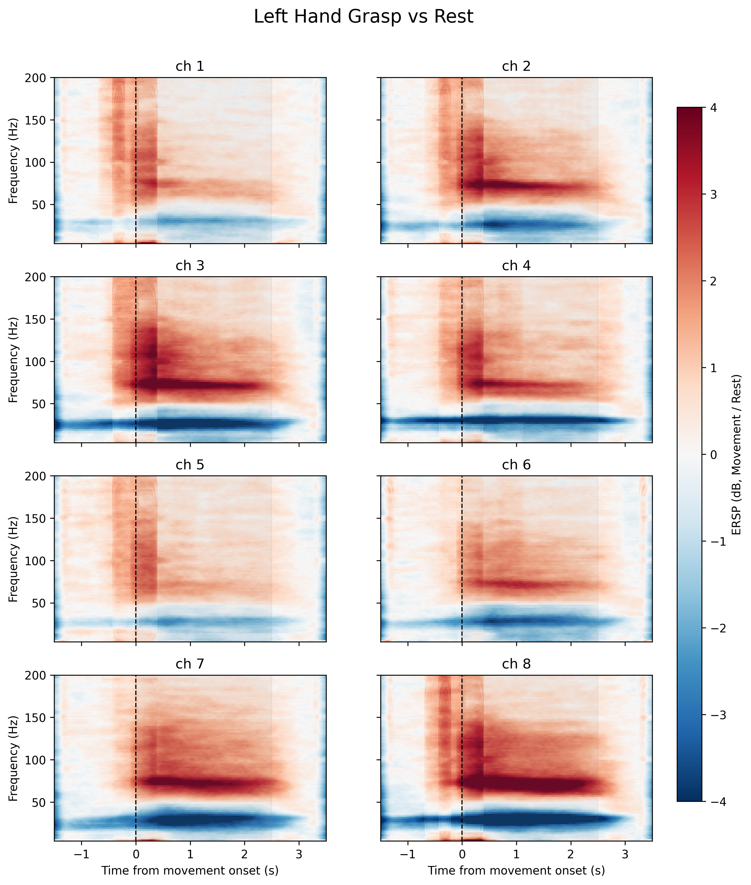
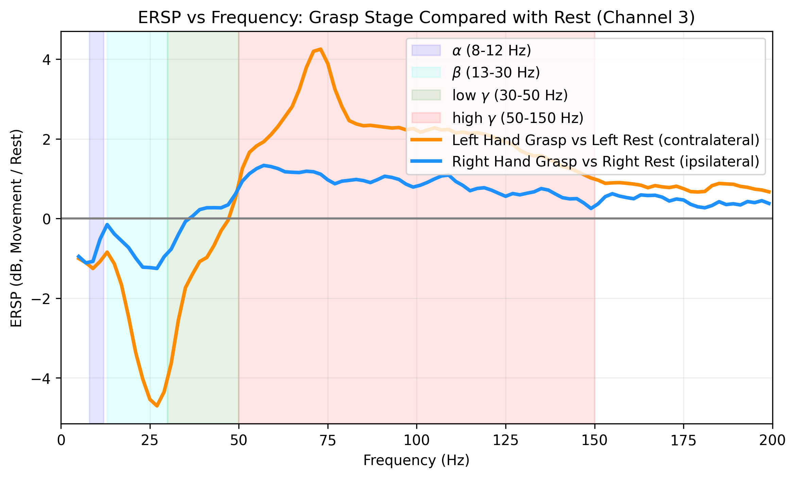

# 任务 1：手部抓握运动神经活动分析说明

## 1. 本任务做了什么

本任务针对 `single-movement` 数据中的左手抓握和右手抓握 block，分析了被试在**尝试抓握阶段**相对于**静息阶段**的硬膜外皮质脑电频谱变化。

按照作业 PDF 中的实验范式：

* 左手抓握：`trigger 5` 后 0–2.5 s 作为运动尝试阶段，`trigger 6` 后 0–2.0 s 作为 Rest 阶段；
* 右手抓握：`trigger 7` 后 0–2.5 s 作为运动尝试阶段，`trigger 8` 后 0–2.0 s 作为 Rest 阶段。

本任务计算了 Movement / Rest 的事件相关频谱扰动，即 ERSP：

$$
\mathrm{ERSP}=10\log_{10}\left(\frac{P_{\mathrm{movement}}}{P_{\mathrm{rest}}}\right)
$$

其中，ERSP 大于 0 表示动作尝试阶段相对于静息阶段能量增强，ERSP 小于 0 表示动作尝试阶段相对于静息阶段能量下降。

---

## 2. 左手抓握 vs Rest 的时频图结果

上图展示了左手尝试抓握阶段相对于 Rest 阶段的 8 通道 ERSP 时频图。横轴为相对于动作开始时刻的时间，纵轴为频率，颜色表示 Movement / Rest 的能量变化。

从图中可以看到，左手抓握开始后，多个通道都出现了比较明显的运动相关频谱变化：

首先，在约 15–35 Hz 的低频段，尤其是 beta 频段，动作阶段相对于 Rest 阶段出现明显能量下降，表现为蓝色区域。这说明左手抓握尝试过程中出现了低频事件相关去同步化，即 ERD。

其次，在约 50–150 Hz 的 high gamma 频段，动作开始后出现明显能量增强，表现为红色区域。其中 ch2、ch3、ch4、ch7、ch8 的 high gamma 增强比较明显，说明左手尝试抓握能够在右半球感觉运动皮层诱发较强的局部高频神经活动。

需要注意的是，本图采用的是 Movement / Rest 的功率比值，而不是动作前 baseline 校正，因此 0 秒前也可能存在一定颜色变化。后续分析和展示时，建议重点关注 0–2.5 s 的动作尝试阶段。

---

## 3. 左手与右手抓握的频率曲线对比

为了更直观地比较左手和右手抓握的差异，我选取了右半球代表性通道 ch3，计算 0–2.5 s 动作阶段内的平均 ERSP，并画出了不同频率上的能量变化曲线。

由于电极位于右侧大脑半球，左手抓握主要对应对侧运动，右手抓握则主要对应同侧运动。因此，这张图可以用于比较右半球 eECoG 对对侧与同侧手部运动意图的响应差异。

ch3 的主要结果如下：

| 频段                   | 左手抓握 vs Rest | 右手抓握 vs Rest | 结果解释                  |
| -------------------- | -----------: | -----------: | --------------------- |
| alpha，8–12 Hz        |    -1.165 dB |    -0.795 dB | 左右手均有一定低频下降           |
| beta，13–30 Hz        |    -3.007 dB |    -0.830 dB | 左手 beta ERD 更明显       |
| low gamma，30–50 Hz   |    -1.190 dB |     0.081 dB | 左手在该频段仍偏下降            |
| high gamma，50–100 Hz |     2.602 dB |     1.059 dB | 左手 high gamma 增强更强    |
| high gamma，50–150 Hz |     2.200 dB |     0.881 dB | 左手整体 high gamma 反应更明显 |

结果显示，左手抓握在 ch3 上表现出典型的“低频下降 + high gamma 增强”模式。其中 beta 频段平均 ERSP 为 -3.007 dB，说明动作尝试阶段低频同步活动明显减弱；50–100 Hz high gamma 平均 ERSP 为 2.602 dB，说明动作尝试阶段局部高频活动明显增强。

右手抓握也存在一定的 high gamma 增强，但幅度低于左手抓握。因此，结果更适合表述为：**右半球 eECoG 对左手对侧抓握运动意图的响应更强，但同侧右手运动并非完全没有反应。**

---

## 4. 这个结果说明了什么

本任务结果说明，即使被试由于脊髓损伤无法完成真实手部运动，其在主观上尝试抓握时，右半球感觉运动皮层仍然能够产生可观测的神经活动变化。

最核心的现象是：

* 低频段，尤其是 beta 频段，出现能量下降，即 ERD；
* high gamma 频段，尤其是 50–100 Hz 或 50–150 Hz，出现能量增强，即 ERS；
* 左手抓握作为右半球电极的对侧运动，其 high gamma 增强明显强于右手抓握。

这说明 high gamma 能量可以作为后续抓握解码和手势分类任务的重要神经特征。

---

## 5. 对后续任务的提示

### 对任务 2：手部抓握连续神经解码

任务 2 需要从神经信号中实时预测抓握概率。根据任务 1 的结果，建议优先使用 high gamma 能量作为核心特征。

具体建议：

* 优先提取 50–100 Hz 或 50–150 Hz 频段能量；
* 可以使用滑动时间窗计算每个时间点附近的 high gamma 能量；
* 不建议只使用单通道，最好保留 8 个通道的 high gamma 能量作为多通道特征；
* beta 频段 ERD 也有运动相关信息，可以作为辅助特征；
* 左手抓握的对侧 high gamma 反应最明显，因此任务 2 中对侧左手 grasp block 应该更容易解码。

### 对任务 3：多手势运动分类

任务 3 需要比较不同手势的 Flex 阶段，并建立手势分类模型。任务 1 的结果提示，high gamma 是比较有区分度的运动相关频段。

具体建议：

* 每个 trial 的 Flex 阶段可以提取 50–100 Hz high gamma 能量；
* 保留通道维度，例如构建 8 个通道的 high gamma 特征向量；
* 可以进一步加入 beta ERD 特征，比较是否提升分类效果；
* 不同手势可能在不同通道上有不同激活模式，因此空间分布特征可能比单通道特征更有用。

### 对任务 4：多手势连续神经解码

任务 4 需要连续解码手势时间序列。任务 1 说明 high gamma 能量能够反映动作尝试阶段，因此可以作为连续解码的主要输入。

具体建议：

* 用滑动窗口实时提取 high gamma 能量；
* 每个时间点保留 8 通道特征；
* 对 high gamma 能量做适当平滑，避免连续解码结果抖动；
* 可以把 high gamma 能量变化作为判断 Flex / Hold / Extend 阶段的重要线索。

---

## 6. 对海报展示的建议

海报中可以重点展示两张图：

1. **左手抓握 vs Rest 的时频图**
   用来说明动作尝试阶段出现了典型的 beta ERD 和 high gamma ERS。

2. **左手与右手抓握的频率曲线对比图**
   用来说明右半球 eECoG 对左手对侧抓握运动的响应更强。

可以在海报上总结为：

> 手部抓握运动意图在 eECoG 中表现为低频 beta 能量下降和 high gamma 能量增强；其中，左手抓握作为右半球电极的对侧运动，诱发了更明显的 high gamma 反应。这说明 high gamma 能量可以作为后续抓握连续解码和多手势分类的重要特征。

---

## 7. 小结

本任务按照作业要求，计算了左手和右手抓握阶段相对于 Rest 阶段的 ERSP。结果显示，左手抓握在右半球 eECoG 中诱发了明显的 beta 频段能量下降和 high gamma 频段能量增强；右手抓握也有一定 high gamma 增强，但整体弱于左手。

因此，后续任务中建议重点使用 high gamma 能量，尤其是 50–100 Hz 或 50–150 Hz 频段，并保留多通道空间特征，用于连续抓握解码和多手势分类。
