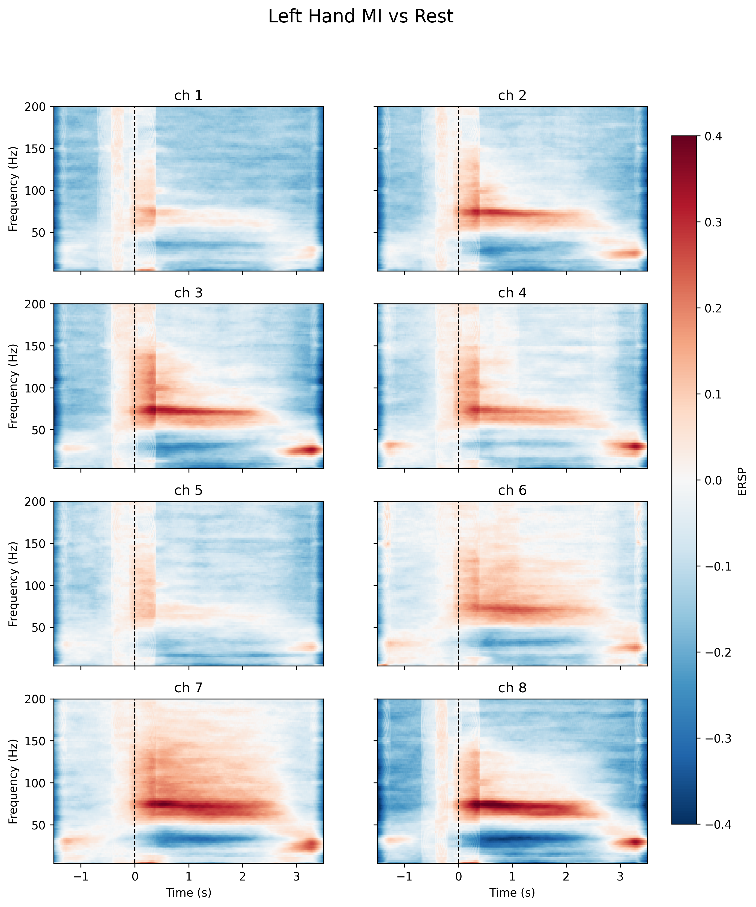
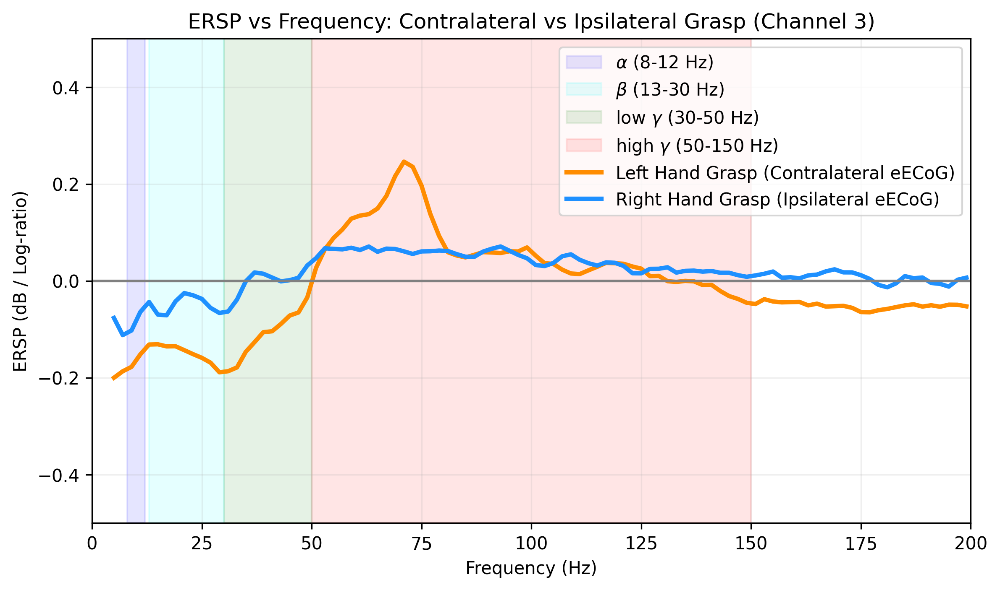

# PBL 任务 1：手部抓握运动神经活动分析报告

## 1. 研究背景与数据说明
本报告基于微创无线脑机接口（NEO）系统采集的真实临床数据。被试为一名 36 岁男性、C4 完全性脊髓损伤的四肢瘫痪患者。我们提取了患者在“尝试左手握拳”和“尝试右手握拳”阶段（运动期）与动作前的延迟准备阶段（静息期）的硬膜外皮质脑电信号（eECoG），计算了事件相关频谱扰动（ERSP），以观察运动意图在大脑运动皮层诱发的频率能量变化。

---

## 2. 时频图（Time-Frequency Map）分析

**观察与分析：**
时频图展示了右脑感觉运动皮层 8 个硬膜外电极通道在尝试运动前后（t=0 为视觉提示开始时刻），不同频率能量随时间的动态演变过程。
* **低频能量下降（蓝色区域）：** 在 t=0 秒动作开始后，可以明显观察到在 10Hz - 30Hz 左右的频段出现了一条持续的蓝色带。这代表**事件相关去同步化（ERD）**。它表明大脑在准备和执行运动时，该区域的神经元打破了静息状态下的低频同步节律，开始进入活跃处理状态。
* **高频能量上升（红色区域）：** 在 50Hz 以上（尤其是 70Hz - 100Hz 之间），t=0 秒后出现了非常显著且强烈的红色高能量区域。这代表**事件相关同步化（ERS）**。它直接反映了局部神经元群体的密集、高频放电活动。
* **空间特异性：** 由于电极分别覆盖在初级运动皮层（ch1-4）和初级感觉皮层（ch5-8），不同通道的反应展现出空间差异。其中，ch2, ch3, ch4, ch7, ch8 的高频 ERS 反应尤为强烈，说明硬膜外电极阵列成功捕捉到了皮层上特定拓扑位置的激活。

---

## 3. ERSP 频率曲线分析（严格对标文献方法）

**观察与分析：**
本图严格参考文献[1]的方法，采用对数比值法（Log-ratio / dB）进行基线校准，提取了运动维持阶段（0 - 2.5 秒）内，右脑初级运动皮层核心通道（ch3）的平均能量随频率变化的曲线，并对左手和右手运动进行了双轨对比：
* **对侧运动（左手尝试抓握 - 橙色线）：** 表现出完美的“低频下沉、高频隆起”特征。
  * 在 $\alpha$ 波 (8-12 Hz) 和 $\beta$ 波 (13-30 Hz) 频段，曲线明显跌破 0 线（最低达 -0.2 dB），表现出强烈的 ERD。
  * 在 **High $\gamma$ 频段 (50-150 Hz)**，曲线高高隆起并跨越 0 线，在 70Hz 左右达到峰值（超过 0.2 dB），表现出强烈的 ERS。
* **同侧运动（右手尝试抓握 - 蓝色线）：** 由于电极全部植入在**右侧大脑半球**，而右手运动主要由左脑控制。因此，当患者尝试动右手时，右脑核心通道（ch3）捕捉不到特异性的高频激活，蓝色曲线在 High $\gamma$ 频段**几乎完全平坦并贴近 0 线**。

**生理学结论：**
尽管患者因脊髓损伤无法产生实际的手部肌肉运动，但当其主观上“尝试”动作时，其对侧大脑运动皮层依然能产生高度特异性的脑电模式（低频 ERD + 高频 ERS）。这种强烈的对侧激活 vs 同侧静息的科学对比，证实了硬膜外皮质脑电（eECoG）具有极高的空间分辨率和信号特异性。

---

## 4. 对后续任务的指导与启发（💡 核心特征工程指南）

本节分析对负责研发 **连续解码算法（任务 2、4）** 和 **多手势分类（任务 3）** 的同学至关重要。基于任务 1 的结论，在后续模型设计中应采取以下特征提取策略：

### 🎯 任务 2：手部抓握连续神经解码
* **绝对核心特征：** **不要把原始脑电时间序列直接扔进模型！** 务必先进行带通滤波。根据图 1d，最佳的特征提取频段是 **High Gamma (50-150 Hz)**。
* **对同侧干扰的抑制：** 训练集和测试集中包含了右手 Block。通过图 1d 可以看出，右手动作时右脑的 High $\gamma$ 能量是平坦的。因此，算法可以通过提取 50-150Hz 的包络（如 Hilbert 变换）或频带能量，极其轻松地过滤掉同侧右手动作的干扰，精准预测对侧左手的抓握概率。

### 🎯 任务 3：多手势运动分类
* **侧向选择性与空间特征利用：** 实验证实了该 BCI系统具备完美的侧向选择性（对侧强、同侧无响应）。同时，不同的手势（如大拇指动 vs 食指动）在右脑 8 个通道上的激活强度存在微小拓扑差异。
* **操作建议：** 在提取特征时，不仅要提取时间窗口内的 High Gamma 能量，还要保留**通道维度**。建议将 8 个通道的 High Gamma 能量拼接成一个 8 维的特征向量送入分类器（如 SVM、随机森林或浅层神经网络），利用空间通道的权重差异来实现多手势的高精度分类。

### 🎯 任务 4：多手势运动连续神经解码
* **时空特征结合与平滑：** 在每个时间步，提取所有通道的 High $\gamma$ 能量特征（空间维度），并结合历史时间步的信息（时间维度），送入动态解码模型（如卡尔曼滤波 KF 算法）。
* **避免抖动：** 由于脑电高频能量在实时提取时存在一定的高频噪声抖动，建议在将能量特征送入解码器前，进行适当的低通平滑处理（如 1Hz-2Hz 的低通滤波），这会让后续机械手（MuJoCo 里的 Omnihand 模型）的虚拟控制轨迹显得更加平滑、连续且自然。

---

## 5. 参考文献
[1] D. Liu, Y. Shan, P. Wei, W. Li, H. Xu, F. Liang, T. Liu, G. Zhao, and B. Hong, "Reclaiming motor functions after complete spinal cord injury with epidural minimally invasive brain-computer interface," medRxiv, 2024.
