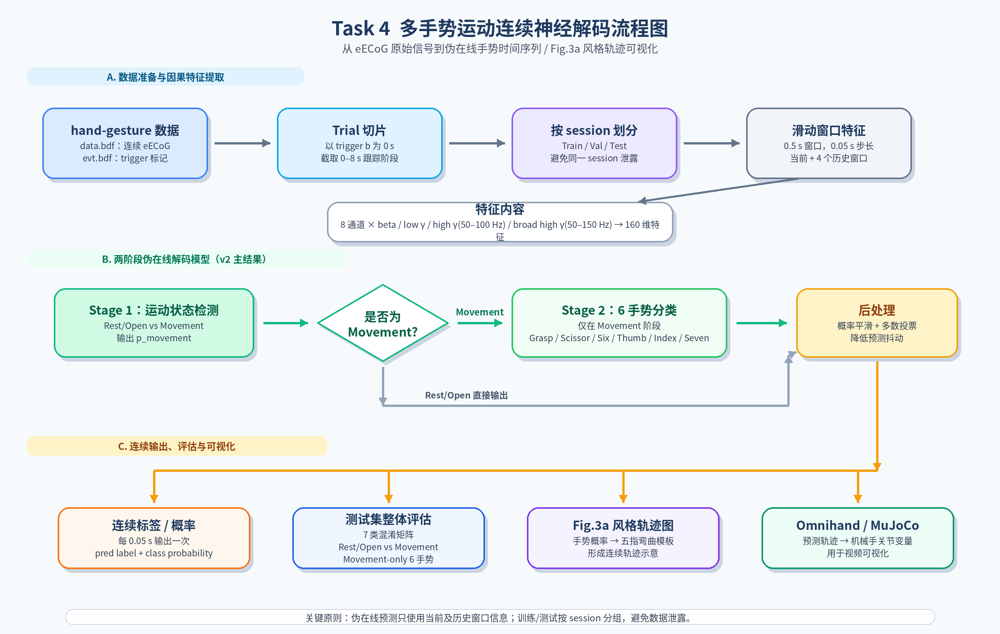
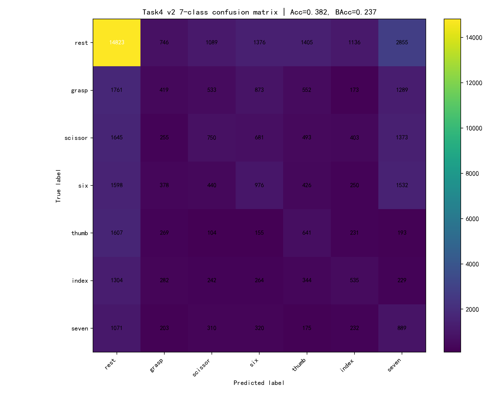
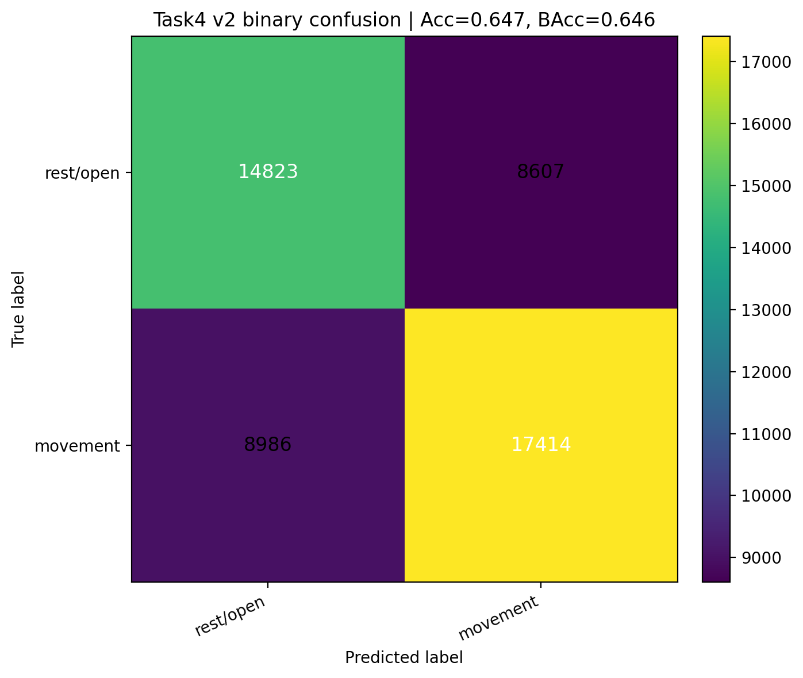
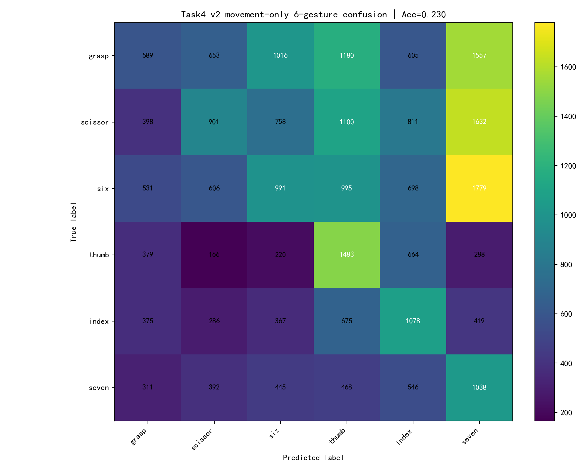
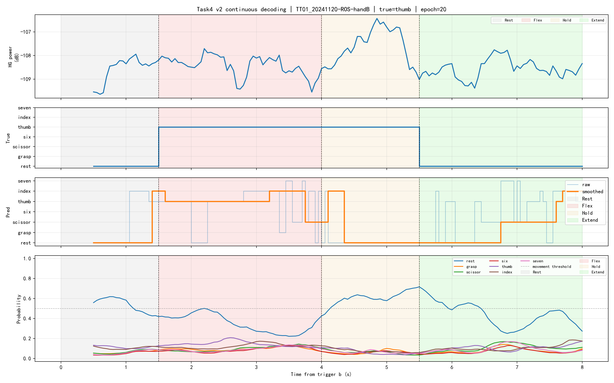

# 任务四：多手势运动连续神经解码说明（海报同学版）

> 本说明主要面向后续做海报和结果整理的同学，用来解释任务四做了什么、用了哪些数据和方法、图应该怎么看，以及最终可以得出什么结论。  
> 图片路径已按当前结果文件夹先插入了代表性图片，后续如果要换图，只需要替换 Markdown 里的图片路径即可。

---

## 1. 本任务要解决什么问题

任务四的目标是：在任务二“连续抓握解码”和任务三“多手势分类”的基础上，进一步尝试从硬膜外皮质脑电信号（eECoG）中**伪在线连续解码多种手势的时间序列**。

也就是说，本任务不是只判断一个 trial 属于哪一种手势，而是希望在一个 0–8 s 的手势跟踪过程中，每隔一个短时间窗都输出一次模型判断，例如：

```text
0.50 s  → rest
1.50 s  → scissor / grasp / thumb / ...
4.00 s  → hold 当前手势
5.50 s  → rest/open 或 extend
```

因此，本任务更接近在线脑机接口控制中的需求：模型需要随着时间连续输出预测结果，而不是只做离线分类。

---

## 2. 使用的数据

本任务使用的是 `data/hand-gesture` 文件夹中的多手势数据。每个子文件夹通常对应一次 recording/session，里面包含：

```text
data.bdf  → 连续采集的 eECoG 原始神经信号
evt.bdf   → 事件标记文件，用于定位每个 trial 的开始时间
```

数据中包含 6 种手势：

```text
Grasp / Scissor / Six / Thumb / Index / Seven
```

其中 `handA` 和 `handB` 表示两组不同手势集合：

| 文件类型 | 包含手势 | trigger b 对应关系 |
|---|---|---|
| handA | scissor, six, grasp | 1 → scissor, 4 → six, 7 → grasp |
| handB | index, seven, thumb | 1 → index, 4 → seven, 7 → thumb |

每个 trial 以 `trigger b` 作为 0 s，0–8 s 为视频跟踪阶段，时间结构如下：

| 时间段 | 阶段 | 含义 |
|---|---|---|
| 0–1.5 s | Rest | 手处于静息 / 平展状态 |
| 1.5–4.0 s | Flex | 开始形成目标手势 |
| 4.0–5.5 s | Hold | 保持目标手势 |
| 5.5–8.0 s | Extend | 手势复位到平展状态 |

---

## 3. 方法概述

最终主模型采用 **v2 两阶段伪在线连续解码框架**。

### 3.1 方法流程图（海报推荐图 1，你也可以根据代码逻辑让ai画）



### 3.3 v2 特征提取设置

| 参数 | 设置 |
|---|---|
| 窗口长度 | 0.5 s |
| 步长 | 0.05 s |
| 历史窗口 | 当前窗口 + 前 4 个历史窗口 |
| 通道 | 8 个 eECoG 通道 |
| 频段 | beta 13–30 Hz, low gamma 30–50 Hz, high gamma 50–100 Hz, broad high gamma 50–150 Hz |
| 特征维度 | 160 |

训练集、验证集和测试集按照 session/folder 分组划分，避免同一 session 同时出现在训练集和测试集中，从而减少数据泄露。

---

## 4. 主要结果

### 4.1  7类连续分类结果（这个可不放）

7 类标签包括：

```text
rest / grasp / scissor / six / thumb / index / seven
```

v2 在测试集上的 7 类 smoothed prediction 结果为：

| 指标 | 数值 |
|---|---:|
| Accuracy | 0.3820 |
| Balanced Accuracy | 0.2373 |



**海报解释建议：**  
这张图用于说明模型在完整测试集上的整体分类结果。可以看到模型不是完全随机，但 6 种手势之间仍然存在明显混淆，因此不能夸大为“已经高精度识别多手势”。

---

### 4.2 Rest/Open vs Movement 运动状态检测（海报推荐图 2，这个建议放）

v2 最有价值的结果是二分类运动状态检测，即判断当前是否处于运动尝试阶段：

```text
rest/open vs movement
```

结果为：

| 指标 | 数值 |
|---|---:|
| Accuracy | 0.6472 |
| Balanced Accuracy | 0.6449 |
| Movement F1 | 0.6729 |



**海报解释建议：**  
这张图是最推荐放在海报上的结果图之一。它说明虽然模型对具体手势的区分还不够稳定，但已经能够较好地区分“静息/张开状态”和“运动尝试状态”。这对于在线 BCI 控制非常关键，因为连续控制首先要知道什么时候开始输出运动指令。

---

### 4.3 Movement-only 6 手势分类结果（海报推荐图 3，这个建议放）

只在真实 movement 阶段内统计 6 种手势分类性能：

```text
grasp / scissor / six / thumb / index / seven
```

结果为：

| 指标 | 数值 |
|---|---:|
| Accuracy | 0.2303 |
| Balanced Accuracy | 0.2613 |



**海报解释建议：**  
这张图用于展示当前模型的瓶颈：6 类随机水平约为 1/6 = 0.167，当前结果高于随机水平，但仍然不高。说明 eECoG 信号中确实包含部分手势类别信息，但当前多频段功率特征还不足以稳定区分 6 种具体手势。

---

## 5. 连续解码图怎么看（海报推荐图 4，这个可不放）

v2 还输出了若干张单 trial 的连续解码图，用于展示模型在时间轴上的预测过程。

这里先放一张 `scissor` trial 作为示例，后续可以换成更好看的 trial：



这类图通常包含四行：

| 图中位置 | 内容 | 作用 |
|---|---|---|
| 第 1 行 | High Gamma power | 展示神经信号能量随时间的变化 |
| 第 2 行 | True label | 展示真实阶段标签 |
| 第 3 行 | Pred label | 展示模型 raw / smoothed 连续预测 |
| 第 4 行 | Class probability | 展示各类别概率随时间变化 |

**海报解释建议：**  
这张图的作用不是单纯展示准确率，而是证明模型确实在做**伪在线连续预测**：每个时间点都有一个预测结果，而不是只对整个 trial 输出一个分类。

---

## 6. Fig.3a 风格连续轨迹图（海报推荐图 5，这个建议放）

为了更接近作业 PDF 中 Fig.3a 的展示形式，我们进一步把 v2 输出的手势概率映射到五根手指的弯曲模板，生成连续五指轨迹图。


图中：

| 曲线 | 含义 |
|---|---|
| 黑线 Ground truth | 根据真实手势标签和 Rest/Flex/Hold/Extend 阶段构造的理想手势轨迹 |
| 绿色 Hard decoded | v2 平滑后硬分类标签映射得到的手指轨迹 |
| 蓝色 Soft decoded | v2 各手势概率加权后得到的连续手指轨迹 |

**重要说明：**  
题目数据没有提供真实五指关节角度，因此这里的 Ground truth 是理想模板，不是真实运动学测量。该图主要用于展示如何将连续神经解码结果转化为手部轨迹可视化，并不代表已经实现高精度真实关节轨迹回归。

---

## 7. 海报展示建议

### 7.1 推荐海报主线(ai写的，看你自己怎么放都行)

海报可以按照下面逻辑讲：

```text
任务目标：
从 eECoG 中连续解码多手势时间序列

方法：
滑动窗口特征 + 两阶段模型
先检测 movement，再识别具体手势

结果：
运动状态检测较好
具体 6 手势分类仍然困难

可视化：
将手势概率映射为五指轨迹，形成 Fig.3a 风格连续轨迹图
```
---

### 7.3 一句话总结

> 我们实现了一个基于 eECoG 多频段能量特征的两阶段伪在线多手势连续解码框架。模型能够较稳定地区分 rest/open 与 movement 状态，但对 6 种具体手势的连续分类仍存在明显混淆。

---

## 8. 局限性与后续改进

当前模型仍存在几个限制：

1. **具体手势分类准确率不高**：movement-only 6 手势 balanced accuracy 只有 0.2613。
2. **Extend 阶段在 v2 中被合并为 Rest/Open**：这简化了任务，但没有完全区分 Extend 与真正 Rest。
3. **Fig.3a 风格图是模板轨迹，不是真实关节角度**：由于数据中没有真实手指运动学轨迹，只能通过手势模板构造 proxy ground truth。
4. **概率曲线仍然较平缓**：说明模型对具体手势的置信度不高，不同手势概率差异有限。

```

最终结果表明：

> eECoG 信号可以较好支持运动状态的连续检测，但目前基于多频段功率特征的模型还不能稳定地区分 6 种细粒度手势。该结果为后续构建更复杂的在线多手势解码模型和 Omnihand 可视化控制提供了基础。
